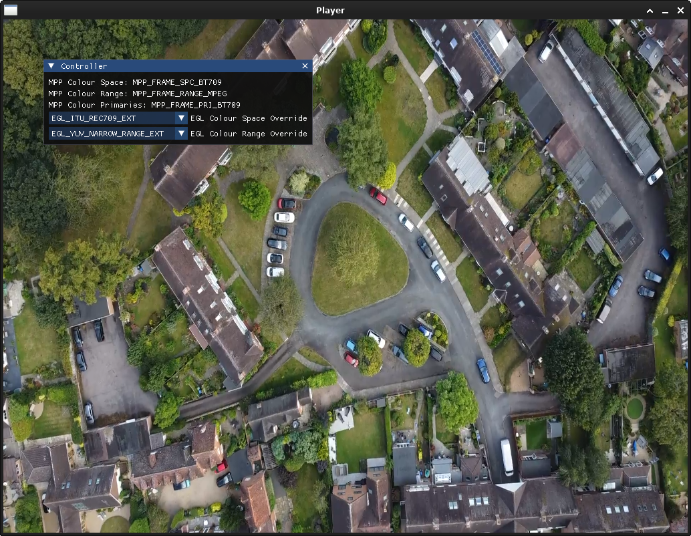

RockchipPlayer README
====================

RockchipPlayer is a simple application for Rockchip devices to hardware decode video files
and display them on screen using OpenGL and ImGui. It is useful as an example on how to use
Rockchip APIs.



## Build

```
git clone git@github.com:MonocleSecurity/RockchipPlayer.git --recursive
cd RockchipPlayer
VCPKG_FORCE_SYSTEM_BINARIES=1 cmake -G"Unix Makefiles" .
make
```

## Run

./RockchipPlayer video.mp4
